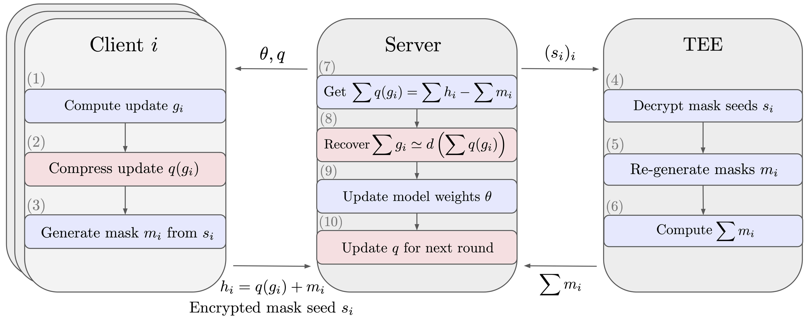

# Secure Federated Learning Compression

This repository implements code for the paper [Reconciling Security and Communication Efficiency in Federated Learning](www.arxiv.com). 

In particular, we highlight the fundamental mismatch between two critical components of the FL stack:
SECAGG protocols and uplink compression mechanisms and we formulate solutions by imposing a linearity constraint on the decompression operator, as illustrated below in the case of TEE-based SECAGG. 

Finally, we adapt the popular scalar quantization and (random) pruning compression methods for
compatibility with the FL stack that require no changes to the SECAGG protocol. For extreme uplink compression without compromising security, we propose Secure Indexing (SecInd), a variant of SECAGG that supports product quantization. 
<p align="center">
  
</p>

## Installation

The dependencies can be installed with: `pip install -r requirements.txt`. 

## Results

To reproduce our results on the CelebA dataset, run `cd examples/`, follow the instructions in `celeba_example.py` to download the dataset and partition it by users and finally run:
```
python celeba_example.py --config-file configs/target_config_file.json
```
where `target_config_file.json` can be set to:
- `celeba_sq_config.json` for scalar quantization with Secure Aggregation 
- `celeba_pruning_config.json` for Random Pruning with Secure Aggregation
- `celeba_pq_config.json` for PQ with SecureIndexing 

Feel free to vary the arguments of the "channel" field to test all the possible compression ratios!


## License
This code is released under Apache 2.0, as found in the [LICENSE](https://github.com/facebookresearch/SecureFLCompression/blob/main/LICENSE) file.

## Bibliography

Please consider citing [1] if you found the resources in this repository useful.

[1] Prasad, Karthik and Ghosh, Sayan and Cormode, Graham and Mironov, Ilya and Yousefpour, Ashkan and Stock, Pierre. [Reconciling Security and Communication Efficiency in Federated Learning](www.arxiv.com).

```
@misc{prasad2022reconciling,
  title = {Reconciling Security and Communication Efficiency in Federated Learning},
  author = {Prasad, Karthik and Ghosh, Sayan and Cormode, Graham and Mironov, Ilya and Yousefpour, Ashkan and Stock, Pierre},
  year = {2022}
}
```